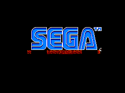
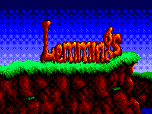

Lemmings asset hacks
====================

This repository contains code and source data for hacking the assets of Lemmings for the Sega Master System. 
You will need to provide a ROM and [build tools](https://github.com/maxim-zhao/sms-build-tools) to make use of it.

The [png](png) directory contains assets, mostly exactly as extracted from the ROM. Some parts are unused, but are there because they are in the original (e.g. the two player option art). 
Some are tilesets rather than images.

These are converted to the game's data formats using [BMP2Tile](https://github.com/maxim-zhao/bmp2tile). 
You can optionally replace the compression with something stronger to help keep within the original 256KB ROM size. 
Much of the art is fixed-size, but some parts are dynamically placed and can make use of a larger ROM if necessary.

The [wav](wav) directory contains samples used to replace those used in the game with better-quality renditions, using the original Amiga sample data and [pcmenc](https://github.com/maxim-zhao/pcmenc) for high quality playback on the Master System.

Some additional minor hacks are made to the original assets:

1. The Sega logo on startup was coloured pink, seemingly by mistake; now it is white
2. The falling lemming in the intro had some glitchy pixels and a cut off hand
3. Each level style may have its own palette
4. The time display includes a colon between the minutes and seconds
5. The "rope" trap would shift one pixel when activated; this no longer happens

Possible future features include:

1. Some speed improvements
2. Additional level styles, to allow "restoration" of some of the missing levels